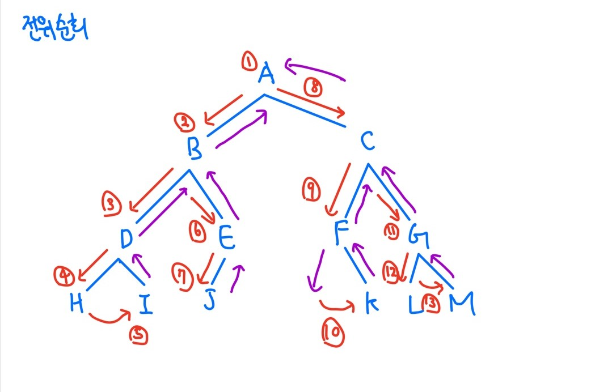
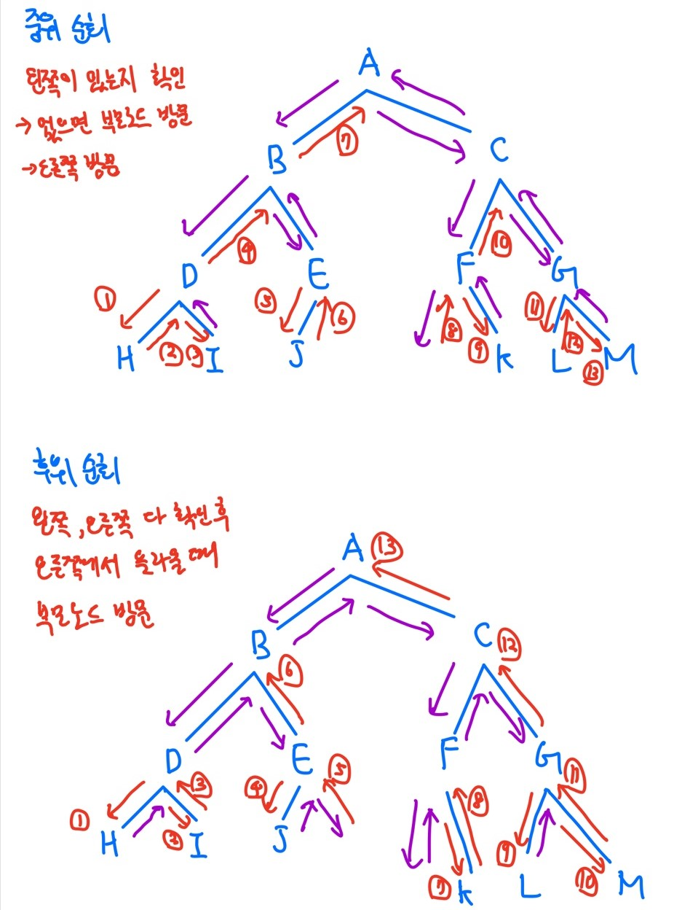

# 트리(tree)

트리는 비선형 구조로, 1:n 관계로 가지가 뻗어나가는 형태의 자료구조를 말한다.

=> 원소들 간 계층관계가 있음!


최상위 노드를 루트(root)라고 하며, 나머지 노드들은 n개의 분리 집합(서브트리)으로 분리될 수 있다.

(재귀적인 형태를 가짐)

##### 용어

- root(루트): 최상위 노드
- degree(차수): 노드에 연결된 자식 노드의 수(이진 트리의 경우 최대 2개)
- leaf node(단말 노드, 리프 노드): 차수가 0인 노드, 자식 노드가 없는 노드
- level(높이)
  - 노드의 높이: 루트에서 노드에 이르는 간선의 수
  - 트리의 높이: 트리에 있는 노드의 높이 중에서 가장 큰 값, 최대 레벨

##### 중요 포인트

- root는 부모 노드가 없다.

- 서브트리는 부모 노드와 연결된 간선을 끊었을 때 생성되는 또다른 트리를 말한다.


## 이진 트리

- 모든 노드들이 **최대 2개**의 서브트리를 갖는 형태의 트리
-  각 노드가 자식 노드를 최대한 2개 까지만 가질 수 있는 트리
  - left child node
  - right child node
- 높이가 h인 이진 트리가 가질 수 있는 노드의 최소 개수는 h+1개, 최대 개수는 2^(h+1) - 1 개


##### 포화 이진 트리(Full Binary Tree)

- 모든 레벨에 노드가 포화상태로 차 있는 이진 트리
- 2^(h+1)-1개의 노드를 가지는 이진 트리(h=트리의 높이)
- 루트를 1번으로 하면, 2^(h+1)-1 까지의 노드 번호를 가짐


##### 완전 이진 트리(Complete Binary Tree)

노드 번호 1번부터 n번까지 빈 자리가 없는 이진 트리

- 오른쪽 자식이 있으면 왼쪽 자식도 있다!

##### 편향 이진 트리(skewed Binary Tree)

- 높이 h에 대한 최소 개수의 노드를 가지면서 한쪽 방향의 자식 노드만을 가진 이진 트리


### 순회(traversal)

트리의 노드들을 체계적으로 방문하는 것을 말함. 전위순회, 중위순회, 후위순회가 있음.

##### 전위순회(preorder traversal): VLR

- 부모노드 방문 후 자식노드를 좌우 순서로 방문한다.

```python
def preorder(T):
    if T:
        visit(T)
        preorder(T.left)
        preorder(T.right)
```




**중위순회(inorder traversal): LVR**

- 왼쪽 자식노드, 부모노드, 오른쪽 자식노드 순으로 방문한다.

```python
def inorder(T):
    if T:
        inorder(T.left)
        visit(T)
        inorder(T.right)
```

**후위순회(postorder traversal): LRV**

- 자식노드를 좌우 순서로 방문한 후, 부모노드로 방문한다.

```python
def postorder(T):
    if T:
        postorder(T.left)
        postorder(T.right)
        visit(T)
```





